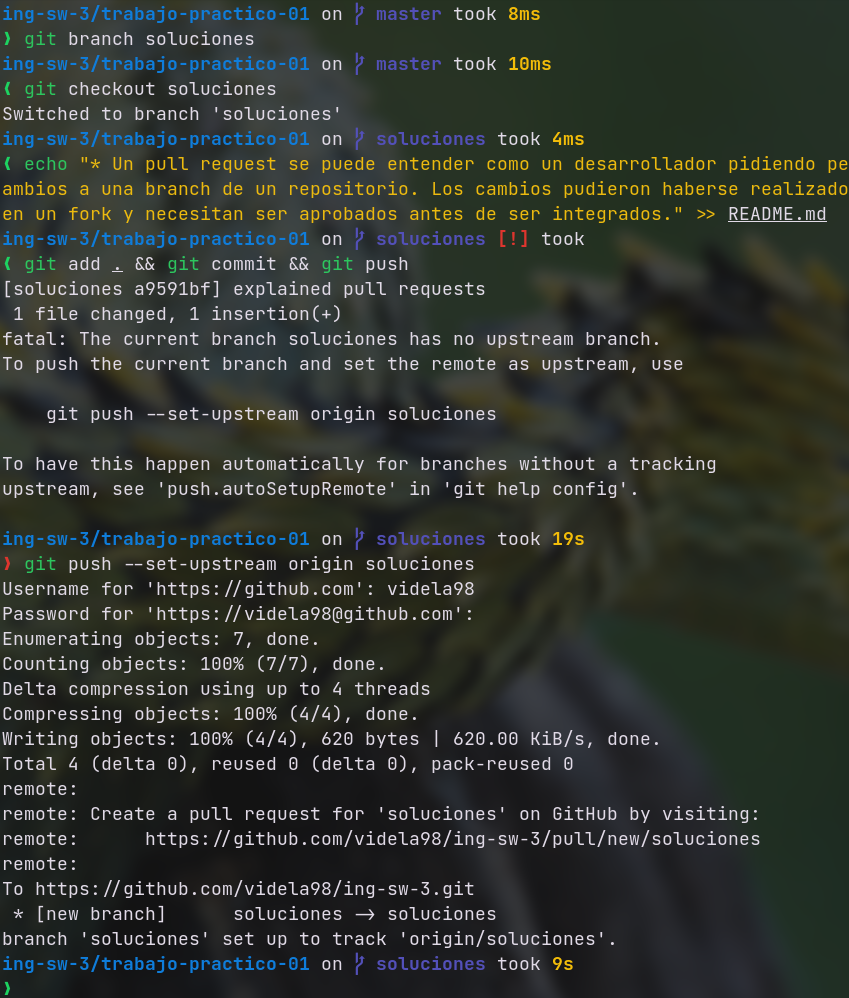
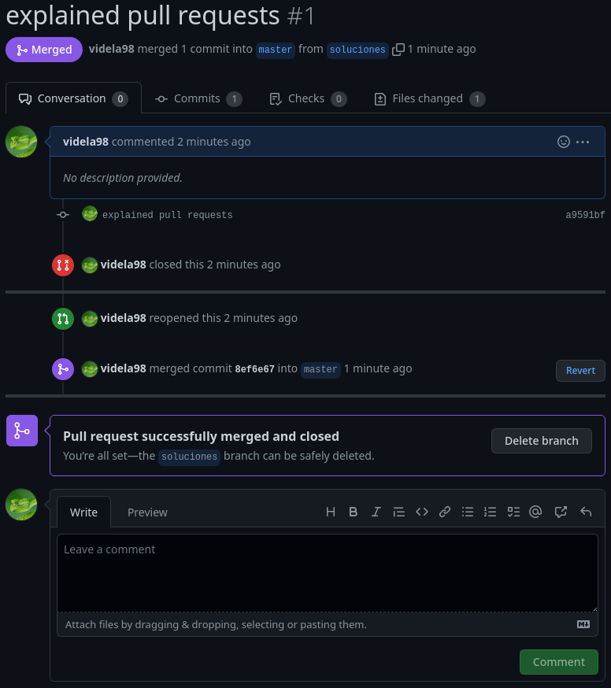

# Resolución TP1

## 4

Un pull request se puede entender como un desarrollador pidiendo permiso para subir cambios a una branch de un repositorio. Los cambios pudieron haberse realizado en otro branch o en un fork y necesitan ser aprobados antes de ser integrados.

### Branch local y cambios:

### Pull Request y Revisión:
conflict

