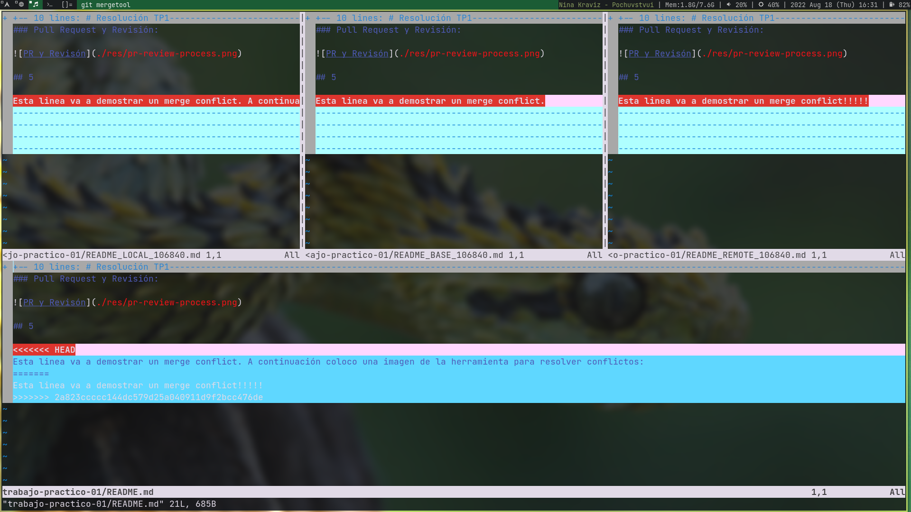

# Resolución TP1

## 4

Un pull request se puede entender como un desarrollador pidiendo permiso para subir cambios a una branch de un repositorio. Los cambios pudieron haberse realizado en otro branch o en un fork y necesitan ser aprobados antes de ser integrados.

### Branch local y cambios:


### Pull Request y Revisión:


## 5

Esta linea va a demostrar un merge conflict. A continuación coloco una imagen de la herramienta para resolver conflictos:



No pude solucionar el error con la herramiento así que utilicé el siguiente comando para hacerlo manualmente:

```
❯ git push --force
Username for 'https://github.com': videla98
Password for 'https://videla98@github.com':
Enumerating objects: 7, done.
Counting objects: 100% (7/7), done.
Delta compression using up to 4 threads
Compressing objects: 100% (4/4), done.
Writing objects: 100% (4/4), 597 bytes | 597.00 KiB/s, done.
Total 4 (delta 1), reused 0 (delta 0), pack-reused 0
remote: Resolving deltas: 100% (1/1), completed with 1 local object.
To https://github.com/videla98/ing-sw-3/
 + 2a823cc...da835b9 master -> master (forced update)
```
