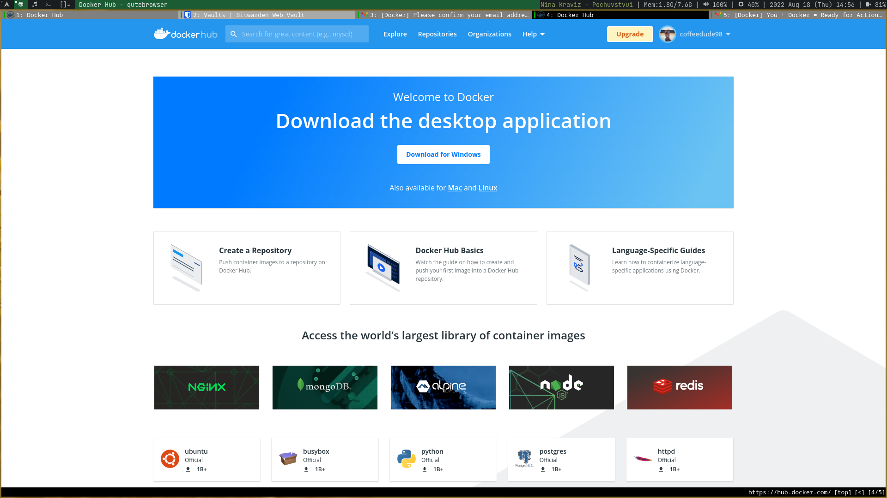
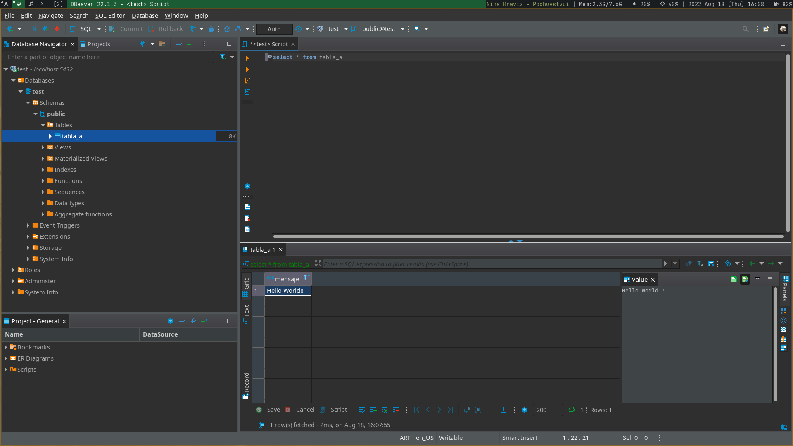

# Resolución TP2

## 1

Ya tenía instalado Docker:
```
❯ docker version 
Client: 
 Version:           20.10.17 
 API version:       1.41 
 Go version:        go1.18.3 
 Git commit:        100c70180f 
 Built:             Sat Jun 11 23:27:28 2022 
 OS/Arch:           linux/amd64 
 Context:           default 
 Experimental:      true 
Server: 
 Engine: 
  Version:          20.10.17 
  API version:      1.41 (minimum version 1.12) 
  Go version:       go1.18.3 
  Git commit:       a89b84221c 
  Built:            Sat Jun 11 23:27:14 2022 
  OS/Arch:          linux/amd64 
  Experimental:     false 
 containerd: 
  Version:          v1.6.8 
  GitCommit:        9cd3357b7fd7218e4aec3eae239db1f68a5a6ec6.m 
 runc: 
  Version:          1.1.3 
  GitCommit: 
 docker-init: 
  Version:          0.19.0 
  GitCommit:        de40ad0 
```

## 2



## 3

Descargo BusyBox:

```
❯ docker pull busybox 
Using default tag: latest 
latest: Pulling from library/busybox 
50783e0dfb64: Pull complete 
Digest: sha256:ef320ff10026a50cf5f0213d35537ce0041ac1d96e9b7800bafd8bc9eff6c693 
Status: Downloaded newer image for busybox:latest 
docker.io/library/busybox:latest 
```

Verifico imagenes instaladas:

```
❯ docker images 
REPOSITORY   TAG       IMAGE ID       CREATED         SIZE 
busybox      latest    7a80323521cc   2 weeks ago     1.24MB 
cassandra    latest    9d2cacdb6911   10 months ago   341MB 
```

BusyBox pesa 1.24MB

## 4

BusyBox es una caja de herramientas, si no se le especifica qué herramienta usar su comportamiento por defecto es no hacer nada.

Podría por ejemplo correr el comando echo:
```
❯ docker run busybox echo "Hello World" 
Hello World 
```

Verificos qué contenedores están en ejecución:

```
❯ docker ps 
CONTAINER ID   IMAGE     COMMAND   CREATED   STATUS    PORTS     NAMES 
```

No aparece nada porque BusyBox ya dejó de correr. Puedo ver todos los contenedores con:

```
❮ docker ps -a 
CONTAINER ID   IMAGE              COMMAND                  CREATED         STATUS                      PORTS     NAMES 
97791a72d18c   busybox            "echo 'Hello World'"     3 minutes ago   Exited (0) 3 minutes ago              zen_keller 
1559f52a6ce0   busybox:latest     "sh"                     5 minutes ago   Exited (0) 5 minutes ago              modest_almeida 
5b4287329199   busybox:latest     "sh"                     7 minutes ago   Exited (0) 7 minutes ago              nostalgic_cannon 
b930f718289d   cassandra:latest   "docker-entrypoint.s…"   9 months ago    Exited (143) 9 months ago             cassandra2 
87d815298825   cassandra:latest   "docker-entrypoint.s…"   9 months ago    Exited (137) 9 months ago             cassandra1 
```

BusyBox aparece varias veces por que se creó un nuevo contenedor por cada ejecución.

## 5

Utilizo el modo interactivo:

```
❯ docker run -it busybox sh 
/ # ps 
PID   USER     TIME  COMMAND 
    1 root      0:00 sh 
    7 root      0:00 ps 
/ # uptime 
 18:12:08 up 35 min,  0 users,  load average: 0.18, 0.22, 0.29 
/ # free 
              total        used        free      shared  buff/cache   available 
Mem:        8021516     2105092     4289884      132540     1626540     5499956 
Swap:             0           0           0 
/ # ls -l / 
total 36 
drwxr-xr-x    2 root     root         12288 Jul 29 01:32 bin 
drwxr-xr-x    5 root     root           360 Aug 18 18:11 dev 
drwxr-xr-x    1 root     root          4096 Aug 18 18:11 etc 
drwxr-xr-x    2 nobody   nobody        4096 Jul 29 01:32 home 
dr-xr-xr-x  244 root     root             0 Aug 18 18:11 proc 
drwx------    1 root     root          4096 Aug 18 18:12 root 
dr-xr-xr-x   13 root     root             0 Aug 18 18:11 sys 
drwxrwxrwt    2 root     root          4096 Jul 29 01:32 tmp 
drwxr-xr-x    3 root     root          4096 Jul 29 01:32 usr 
drwxr-xr-x    4 root     root          4096 Jul 29 01:32 var 
/ # exit 
```

## 6

A continuación elimino todos los contenedores que no se están ejecutando:

```
❯ docker container prune 
WARNING! This will remove all stopped containers. 
Are you sure you want to continue? [y/N] y 
Deleted Containers: 
3fb80768f8a261fe96af8941c8a7c3a663ce262a9f1ae7716f891030cacae2de 
38957285f494d4c46229e76b814b455d5a5cb90f1dec09efac887028c8ba6da6 
97791a72d18ccd05453abe593ad19b97f76fad80ce62da0426acf7c59a501fa5 
1559f52a6ce00f7ab75143daf62810cae74bfc31dfe52e3397d95bdafbfcd983 
5b4287329199d3c4ea2033c9cb8dc21720fcdcb3bd24ef6959991ac4ac6be0af 
b930f718289dea9a82ef24012c6f24c2cfe3e91b250e8217ab93cc8dadb1a77c 
87d8152988257fb77a65f25b747e3034d67ef08d3359a4668c825b2a57b73dec 
Total reclaimed space: 198.1MB 
```

También eliminé los contenedores que utilicé hace 9 meses para otra materia.

## 7

Los volumenes sirven para montar carpetas externas dentro de un contenedor de docker.

```
❯ docker run -it -v /home/agus/Documents/facultad/cursada_2022/ing-sw-3/ing-sw-3/trabajo-practico-02/shared:/var/escritorio busybox /bin/sh 
/ # ls -l /var/escritorio/ 
total 0 
/ # touch /var/escritorio/hola.txt 
/ # echo "hecho desde el contenedor" > /var/escritorio/hola.txt 
/ # exit 
```

Verifico que el archivo aparece en la carpeta montada:

```
❯ cat shared/hola.txt 
hecho desde el contenedor 
```

## 8

Ejecuto un una imagen que publica información al puerto 80

```
❯ docker run -d daviey/nyan-cat-web 
Unable to find image 'daviey/nyan-cat-web:latest' locally 
latest: Pulling from daviey/nyan-cat-web 
b7f33cc0b48e: Pull complete 
5f9b58fd6dd4: Pull complete 
1adeef8edfca: Pull complete 
cc8a2986b124: Pull complete 
7220539c61d6: Pull complete 
Digest: sha256:57ac8fd383ada137e22a2894e92f74287f4566be0ae21ca97828b34a93a646c6 
Status: Downloaded newer image for daviey/nyan-cat-web:latest 
77ea699f5a5814ee4bfe932152a94425cdb166f06108d342cf4074b38a20946f 
❯ docker ps 
CONTAINER ID   IMAGE                 COMMAND                  CREATED              STATUS              PORTS             NAMES 
77ea699f5a58   daviey/nyan-cat-web   "nginx -g 'daemon of…"   About a minute ago   Up About a minute   80/tcp, 443/tcp   modest_yonath 
```

Aunque esté corriendo el contenedor, no aparece en localhost:80 porque el puerto del contenedor no está publicado.

Especifico el puerto y corro la aplicación:

```
❯ docker run -d -p 80:80 daviey/nyan-cat-web 
e29617fcb8a5c0b0c8fa464a69ec71aa69a1d1ddb6e92eebcdadede8a6a11505 
```


## 9

Descargo una imagen de PostgreSQL. Utilizo el comando run con la bandera -d para iniciar la imagen en segundo plano. Además publico el puerto 5432 y creo un volumen para guardar la data.

La imagen se descarga automáticamente porque no estaba descargada de antemano.

```
docker run --name my-postgres -e POSTGRES_PASSWORD=password -v /home/agus/Documents/facultad/cursada_2022/ing-sw-3/ing-sw-3/trabajo-practico-02/.postgresql:/var/lib/postgresql/data -p 5432:5432 -d postgres:9.4 
Unable to find image 'postgres:9.4' locally 
9.4: Pulling from library/postgres 
619014d83c02: Pull complete 
7ec0fe6664f6: Pull complete 
9ca7ba8f7764: Pull complete 
9e1155d037e2: Pull complete 
febcfb7f8870: Pull complete 
8c78c79412b5: Pull complete 
5a35744405c5: Pull complete 
27717922e067: Pull complete 
36f0c5255550: Pull complete 
dbf0a396f422: Pull complete 
ec4c06ea33e5: Pull complete 
e8dd33eba6d1: Pull complete 
51c81b3b2c20: Pull complete 
2a03dd76f5d7: Pull complete 
Digest: sha256:42a7a6a647a602efa9592edd1f56359800d079b93fa52c5d92244c58ac4a2ab9 
Status: Downloaded newer image for postgres:9.4 
18f88adeec9c657606db6953b804a4401b80fa2b652a6034af2406ed1aaac69f 
❯ docker ps 
CONTAINER ID   IMAGE          COMMAND                  CREATED         STATUS         PORTS                                       NAMES 
c7fb9a6b95a8   postgres:9.4   "docker-entrypoint.s…"   4 seconds ago   Up 3 seconds   0.0.0.0:5432->5432/tcp, :::5432->5432/tcp   my-postgres 
```

Ejecuto el contenedor que está corriendo en segundo plano en modo interactivo con exec, creo una tabla e inserto una fila:

```
❯ docker exec -it my-postgres bash
root@c7fb9a6b95a8:/# psql -h localhost -U postgres 
psql (9.4.26) 
Type "help" for help. 
postgres=# \l 
                                 List of databases 
   Name    |  Owner   | Encoding |  Collate   |   Ctype    |   Access privileges 
-----------+----------+----------+------------+------------+----------------------- 
 postgres  | postgres | UTF8     | en_US.utf8 | en_US.utf8 | 
 template0 | postgres | UTF8     | en_US.utf8 | en_US.utf8 | =c/postgres          + 
           |          |          |            |            | postgres=CTc/postgres 
 template1 | postgres | UTF8     | en_US.utf8 | en_US.utf8 | =c/postgres          + 
           |          |          |            |            | postgres=CTc/postgres 
(3 rows) 
postgres=# create database test; 
CREATE DATABASE 
postgres=# \connect test 
You are now connected to database "test" as user "postgres". 
test=# create table tabla_a (mensaje varchar(50)); 
CREATE TABLE 
test=# insert into tabla_a (mensaje) values('Hello World!!'); 
INSERT 0 1 
test=# select * from tabla_a; 
    mensaje 
--------------- 
 Hello World!! 
(1 row) 
test=# \q 
root@c7fb9a6b95a8:/# exit
exit
```

Reviso la base de datos desde Dbeaver:


