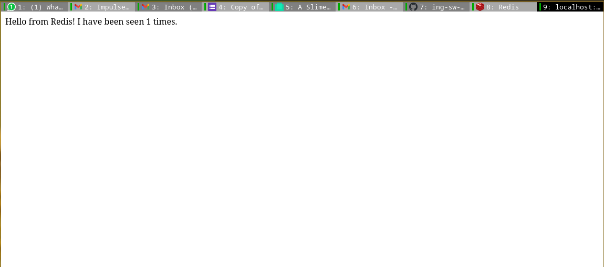

# Resolución TP3

## 1

Creo un bridge para utilizar con los contenedores:

```
❯ docker network create -d bridge ing_tp3
45ff342206aab665f18b49a31c1e131c1c3bf56b9c1de7f1769aac2ac295160c
```

Descargo e instancio una base de datos y una webapp para utilizar con la red.

```
❮ docker run -d --net ing_tp3 --name redis redis:alpine 
Unable to find image 'redis:alpine' locally 
alpine: Pulling from library/redis 
213ec9aee27d: Pull complete 
c99be1b28c7f: Pull complete 
8ff0bb7e55e3: Pull complete 
6d80de393db7: Pull complete 
8dbffc478db1: Pull complete 
7402bc4c98a0: Pull complete 
Digest: sha256:dc1b954f5a1db78e31b8870966294d2f93fa8a7fba5c1337a1ce4ec55f311b
Status: Downloaded newer image for redis:alpine 
c28ebff97cae1452670cb31ad8fe6088a0400724ec00c71064ae962827490f3

❯ docker run -d --net ing_tp3 -e REDIS_HOST=redis -e REDIS_PORT=6379 -p  5000:5000 --name webapp alexisfr/flask-app:latest 
Unable to find image 'alexisfr/flask-app:latest' locally 
latest: Pulling from alexisfr/flask-app 
f49cf87b52c1: Pull complete 
7b491c575b06: Pull complete 
b313b08bab3b: Pull complete 
51d6678c3f0e: Pull complete 
09f35bd58db2: Pull complete 
1bda3d37eead: Pull complete 
9f47966d4de2: Pull complete 
9fd775bfe531: Pull complete 
2446eec18066: Pull complete 
b98b851b2dad: Pull complete 
e119cb75d84f: Pull complete 
Digest: sha256:250221bea53e4e8f99a7ce79023c978ba0df69bdfe620401756da46e34b7c80b 
Status: Downloaded newer image for alexisfr/flask-app:latest 
d9bf9c917d1edadf5d7c97a896df91a1dcb72be2b64cca2290f3e0946b9fa870 
```
Compruebo el correcto funcionamiento de la webapp:



El único puerto abierto es el puerto 5000. El puerto 6379 es sólo accesible por la webapp a través del bridge.

El comando y los detalles de la red son:

```
❯ docker network inspect ing_tp3 
[ 
    { 
        "Name": "ing_tp3", 
        "Id": "45ff342206aab665f18b49a31c1e131c1c3bf56b9c1de7f1769aac2ac295160c", 
        "Created": "2022-08-25T14:28:33.94512011-03:00", 
        "Scope": "local", 
        "Driver": "bridge", 
        "EnableIPv6": false, 
        "IPAM": { 
            "Driver": "default", 
            "Options": {}, 
            "Config": [ 
                { 
                    "Subnet": "172.19.0.0/16", 
                    "Gateway": "172.19.0.1" 
                } 
            ] 
        }, 
        "Internal": false, 
        "Attachable": false, 
        "Ingress": false, 
        "ConfigFrom": { 
            "Network": "" 
        }, 
        "ConfigOnly": false, 
        "Containers": { 
            "c28ebff97cae1452670cb31ad8fe6088a0400724ec00c71064ae962827490f3d": { 
                "Name": "redis", 
                "EndpointID": "ca51b9223a9823ab7eeac7b0f940dc2f4486b7076db76bbd4c8ea1d791e5af06", 
                "MacAddress": "02:42:ac:13:00:02", 
                "IPv4Address": "172.19.0.2/16", 
                "IPv6Address": "" 
            }, 
            "d9bf9c917d1edadf5d7c97a896df91a1dcb72be2b64cca2290f3e0946b9fa870": { 
                "Name": "webapp", 
                "EndpointID": "b53938a4061b71fb22046d25d8b097a9c0f2a253d7958c890d0d6a9f58fd2b47", 
                "MacAddress": "02:42:ac:13:00:03", 
                "IPv4Address": "172.19.0.3/16", 
                "IPv6Address": "" 
            } 
        }, 
        "Options": {}, 
        "Labels": {} 
    } 
] 
```

## 2

La aplicación se conecta a la base de datos e incrementa un contador cada vez que se abre. Luego muestra un mensaje de Hello junto con el valor del contador.

El parámetro -e permite setear variables de entorno, en este caso se utilizan para colocar el nombre de la base de datos y el puerto al que se conecta para que la weapp pueda hacer la conexión.

Si borro el contenedor de la webapp y lo vuelvo a instanciar no ocurren cambios porque la base de datos sigue en pie manteniendo el contador.

Si borro el contenedor de la base de datos la página web tira un error porque no encuentra la conexión. Al volver a instanciar la db la información de la cantidad de visitas se pierda y vuelve a comenzar desde el 1.

Para mantener los datos dentro del contenedor se puede setear un volumen local para que redis guarde y busque los datos.
Según la página oficial de la imagen de redis la persistencia se habilita con:

```
$ redis-server --save 60 1 --loglevel warning
```

Con el comando anterior redis guarda los datos en /data.

Por lo tanto, el comando para iniciar el contenedor de manera persistente y setear un volumen local es:

```
❯ docker run -d --net ing_tp3 -v /home/agus/Documents/facultad/cursada_2022/ing-sw-3/practico/ing-sw-3/trabajo-practico-03/redis_data/:/data --name redis redis:alpine redis-server --save 10 1
9276cf942717996e1a81e3d9b80285d8fb0dedbd140e1c58831fc82c47304ffd
```

Siguiendo estos pasos, la base de datos puede ser desinstalada e instalada sin perder información.

## 3

