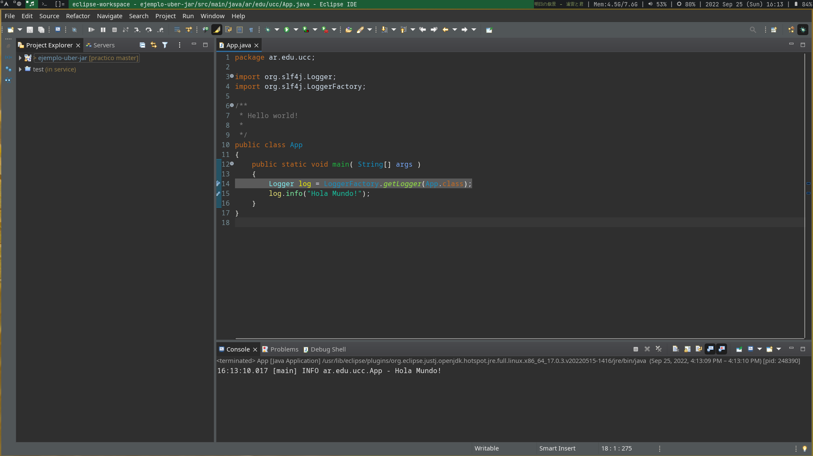
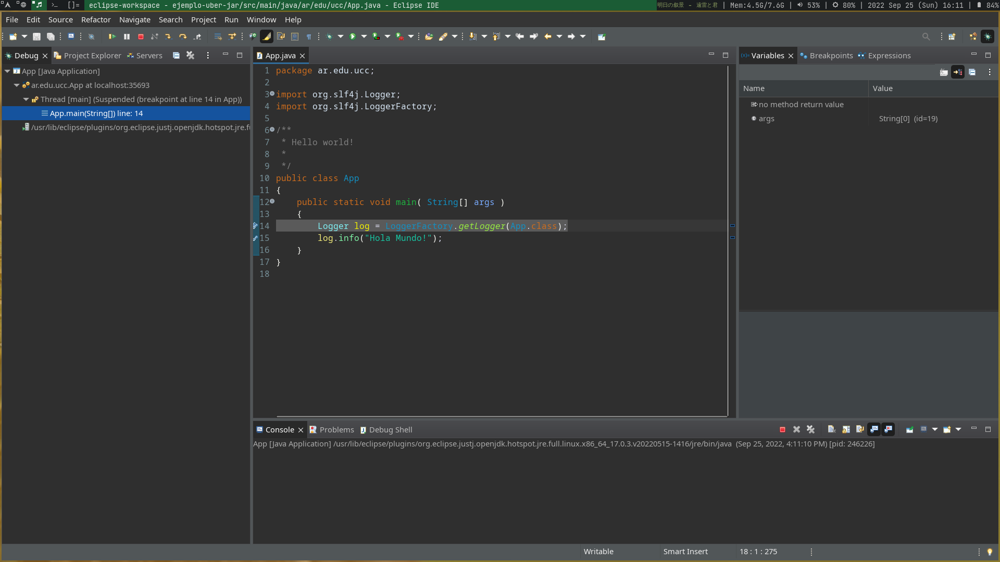
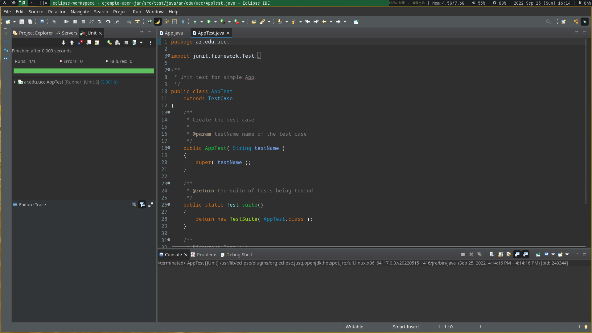
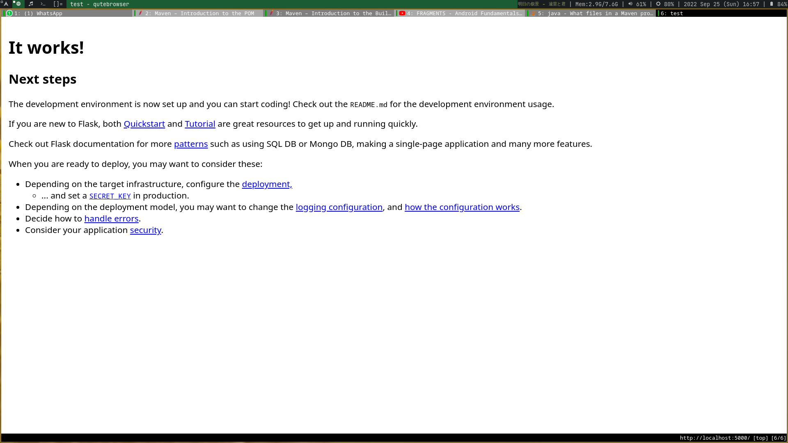

# Resolución TP 5

## 1

```bash
❯ cat $XDG_CONFIG_HOME/profile | grep java 
export JAVA_HOME="/usr/lib/jvm/java-18-openjdk" 
```

## 2


```bash
❯ cat $XDG_CONFIG_HOME/profile | grep maven 
export PATH="/home/agus/Documents/facultad/cursada_2022/ing-sw-3/recursos/apache-maven/apache-maven-3.8.6/bin:$PATH" 
```

## 3

* Maven es una es una herramienta para automatizar builds de proyectos, principalemente hechos en Java. Aunque también es usada en para otros lenguajes como Scala o C#

* El archivo POM es un XML que tiene la información básica acerca del proyecto para que Maven pueda trabajar con él. Contiene opciones de configuración seteables y por defecto. Datos como el directorio build, el directorio fuente, el nombre del projecto, la versión de Maven a utilizar, la versión del proyecto en sí, etc.

* En Maven, los repositorios mantienen 'build artifacts' (proyectos) y dependencias. Hay dos tipos:
    - Repositorio local: Es el repositorio en la computadora en la que Maven está corriendo. Cuando se está construyendo un nuevo artefacto, Maven chachea las dependencias necesarias para no tener que descargar todo múltiples veces.
    - Repositorio remoto: Son los repositorios a los que se accede por medio de protocolos como file:// o https://. Por defecto, al momento de descargar una dependencia Maven lo hace desde un repositorio central que contiene artefactos y dependencias confiables. El repositorio central puede ser cambiado por un repositorio diferente para conseguir las dependencias de otro lado, y también puede configurarse uno diferente por cada dependencia.

* Maven construyó un archivo .jar vacío usando el nombre, versión y groupId que habían en pom.xml. Previo a eso descargó las utilidades que necesitaba.

## 4


```
❮ mvn archetype:generate -DgroupId=ar.edu.ucc -DartifactId=ejemplo -DarchetypeArtifactId=maven-archetype-quickstart -DinteractiveMode=false
[INFO] Scanning for projects...
[INFO]
[INFO] ------------------< org.apache.maven:standalone-pom >-------------------
[INFO] Building Maven Stub Project (No POM) 1
[INFO] --------------------------------[ pom ]---------------------------------
[INFO]
[INFO] >>> maven-archetype-plugin:3.2.1:generate (default-cli) > generate-sources @ standalone-pom >>>
[INFO]
[INFO] <<< maven-archetype-plugin:3.2.1:generate (default-cli) < generate-sources @ standalone-pom <<<
[INFO]
[INFO]
[INFO] --- maven-archetype-plugin:3.2.1:generate (default-cli) @ standalone-pom ---
[INFO] Generating project in Batch mode
[INFO] ----------------------------------------------------------------------------
[INFO] Using following parameters for creating project from Old (1.x) Archetype: maven-archetype-quickstart:1.0
[INFO] ----------------------------------------------------------------------------
[INFO] Parameter: basedir, Value: /home/agus/Documents/facultad/cursada_2022/ing-sw-3/practico/trabajo-practico-05
[INFO] Parameter: package, Value: ar.edu.ucc
[INFO] Parameter: groupId, Value: ar.edu.ucc
[INFO] Parameter: artifactId, Value: ejemplo
[INFO] Parameter: packageName, Value: ar.edu.ucc
[INFO] Parameter: version, Value: 1.0-SNAPSHOT
[INFO] project created from Old (1.x) Archetype in dir: /home/agus/Documents/facultad/cursada_2022/ing-sw-3/practico/trabajo-practico-05/ejemplo
[INFO] ------------------------------------------------------------------------
[INFO] BUILD SUCCESS
[INFO] ------------------------------------------------------------------------
[INFO] Total time:  5.765 s
[INFO] Finished at: 2022-09-25T15:21:42-03:00
[INFO] ------------------------------------------------------------------------

```
❯ mvn clean package 
[INFO] Finished at: 2022-09-22T14:32:19-03:00 
[INFO] ------------------------------------------------------------------------ 
[ERROR] Failed to execute goal org.apache.maven.plugins:maven-compiler-plugin:3.1:compile (defa
[ERROR] Source option 5 is no longer supported. Use 7 or later. 
[ERROR] Target option 5 is no longer supported. Use 7 or later. 
[ERROR] -> [Help 1] 
[ERROR] 
[ERROR] To see the full stack trace of the errors, re-run Maven with the -e switch. 
[ERROR] Re-run Maven using the -X switch to enable full debug logging. 
[ERROR] 
[ERROR] For more information about the errors and possible solutions, please read the following
[ERROR] [Help 1] http://cwiki.apache.org/confluence/display/MAVEN/MojoFailureException 
```

Agregué las siguientes líneas a pom.xml:

```
 <properties>
   <maven.compiler.source>18</maven.compiler.source>
   <maven.compiler.target>18</maven.compiler.target>
 </properties>
```

Para que utilice jdk-18.

```
❮ mvn clean package 
[INFO] Scanning for projects... 
[INFO] 
[INFO] -------------------------< ar.edu.ucc:ejemplo >------------------------- 
[INFO] Building ejemplo 1.0-SNAPSHOT 
[INFO] --------------------------------[ jar ]--------------------------------- 
[INFO] 
[INFO] --- maven-clean-plugin:2.5:clean (default-clean) @ ejemplo --- 
[INFO] Deleting /home/agus/Documents/facultad/cursada_2022/ing-sw-3/practico/trabajo-practico-05/maven/ejemplo/target 
[INFO] 
[INFO] --- maven-resources-plugin:2.6:resources (default-resources) @ ejemplo --- 
[WARNING] Using platform encoding (UTF-8 actually) to copy filtered resources, i.e. build is platform dependent! 
[INFO] skip non existing resourceDirectory /home/agus/Documents/facultad/cursada_2022/ing-sw-3/practico/trabajo-practico-05/maven/ejemplo/src/main/resources 
[INFO] 
[INFO] --- maven-compiler-plugin:3.1:compile (default-compile) @ ejemplo --- 
[INFO] Changes detected - recompiling the module! 
[WARNING] File encoding has not been set, using platform encoding UTF-8, i.e. build is platform dependent! 
[INFO] Compiling 1 source file to /home/agus/Documents/facultad/cursada_2022/ing-sw-3/practico/trabajo-practico-05/maven/ejemplo/target/classes 
[INFO] 
[INFO] --- maven-resources-plugin:2.6:testResources (default-testResources) @ ejemplo --- 
[WARNING] Using platform encoding (UTF-8 actually) to copy filtered resources, i.e. build is platform dependent! 
[INFO] skip non existing resourceDirectory /home/agus/Documents/facultad/cursada_2022/ing-sw-3/practico/trabajo-practico-05/maven/ejemplo/src/test/resources 
[INFO] 
[INFO] --- maven-compiler-plugin:3.1:testCompile (default-testCompile) @ ejemplo --- 
[INFO] Changes detected - recompiling the module! 
[WARNING] File encoding has not been set, using platform encoding UTF-8, i.e. build is platform dependent! 
[INFO] Compiling 1 source file to /home/agus/Documents/facultad/cursada_2022/ing-sw-3/practico/trabajo-practico-05/maven/ejemplo/target/test-classes 
[INFO] 
[INFO] --- maven-surefire-plugin:2.12.4:test (default-test) @ ejemplo --- 
[INFO] Surefire report directory: /home/agus/Documents/facultad/cursada_2022/ing-sw-3/practico/trabajo-practico-05/maven/ejemplo/target/surefire-reports 
------------------------------------------------------- 
 T E S T S 
------------------------------------------------------- 
Running ar.edu.ucc.AppTest 
Tests run: 1, Failures: 0, Errors: 0, Skipped: 0, Time elapsed: 0.016 sec 
Results : 
Tests run: 1, Failures: 0, Errors: 0, Skipped: 0 
[INFO] 
[INFO] --- maven-jar-plugin:2.4:jar (default-jar) @ ejemplo --- 
[INFO] Building jar: /home/agus/Documents/facultad/cursada_2022/ing-sw-3/practico/trabajo-practico-05/maven/ejemplo/target/ejemplo-1.0-SNAPSHOT.jar 
[INFO] ------------------------------------------------------------------------ 
[INFO] BUILD SUCCESS 
[INFO] ------------------------------------------------------------------------ 
[INFO] Total time:  1.587 s 
[INFO] Finished at: 2022-09-22T14:40:46-03:00 
[INFO] ------------------------------------------------------------------------ 
```

El proyecto se contruye con éxito pasando por las primeras 3 etapas del lifecycle.

```
❯ java -cp target/ejemplo-1.0-SNAPSHOT.jar ar.edu.ucc.App 
Hello World! 
```

## 6

```
❯ mvn archetype:generate -DgroupId=ar.edu.ucc -DartifactId=ejemplo-uber-jar -DarchetypeArtifactId=maven-archetype-quickstart -DinteractiveMode=false 
[INFO] Scanning for projects... 
[INFO] 
[INFO] ------------------< org.apache.maven:standalone-pom >------------------- 
[INFO] Building Maven Stub Project (No POM) 1 
[INFO] --------------------------------[ pom ]--------------------------------- 
[INFO] 
[INFO] >>> maven-archetype-plugin:3.2.1:generate (default-cli) > generate-sources @ standalone-pom >>> 
[INFO] 
[INFO] <<< maven-archetype-plugin:3.2.1:generate (default-cli) < generate-sources @ standalone-pom <<< 
[INFO] 
[INFO] 
[INFO] --- maven-archetype-plugin:3.2.1:generate (default-cli) @ standalone-pom --- 
[INFO] Generating project in Batch mode 
[INFO] ---------------------------------------------------------------------------- 
[INFO] Using following parameters for creating project from Old (1.x) Archetype: maven-archetype-quickstart:1.0 
[INFO] ---------------------------------------------------------------------------- 
[INFO] Parameter: basedir, Value: /home/agus/Documents/facultad/cursada_2022/ing-sw-3/practico/trabajo-practico-05 
[INFO] Parameter: package, Value: ar.edu.ucc 
[INFO] Parameter: groupId, Value: ar.edu.ucc 
[INFO] Parameter: artifactId, Value: ejemplo-uber-jar 
[INFO] Parameter: packageName, Value: ar.edu.ucc 
[INFO] Parameter: version, Value: 1.0-SNAPSHOT 
[INFO] project created from Old (1.x) Archetype in dir: /home/agus/Documents/facultad/cursada_2022/ing-sw-3/practico/trabajo-practico-05/ejemplo-uber-jar 
[INFO] ------------------------------------------------------------------------ 
[INFO] BUILD SUCCESS 
[INFO] ------------------------------------------------------------------------ 
[INFO] Total time:  6.098 s 
[INFO] Finished at: 2022-09-25T15:23:54-03:00 
[INFO] ------------------------------------------------------------------------ 
```

Al intentar compilar el paquete, maven informa que las librerías no existen.
Luego de agregar las dependencias, el paquete compila. Pero para ejecutarlo necesito señalar la ubicación de los repositorios:

```
❮ java -cp target/ejemplo-uber-jar-1.0-SNAPSHOT.jar:$HOME/.m2/repository/org/slf4j/slf4j-api/1.7.22/slf4j-api-1.7.22.jar:$HOME/.m2/repository/ch/qos/logback/logback-classic/1.2.1/logback-classic-1.2.1.jar:$HOME/.m2/repository/ch/qos/logback/logback-core/1.2.1/logback-core-1.2.1.jar ar.edu.ucc.App
15:33:55.909 [main] INFO ar.edu.ucc.App - Hola Mundo!
```

Utilizando el plugin uber-jar puedo empaquetar la aplicación y sus dependencias en un único .jar.

```
❯ java -jar target/ejemplo-uber-jar.jar 
15:45:45.564 [main] INFO ar.edu.ucc.App - Hola Mundo!
```

## 7

### Ejecucion del programa



### Debugueo



### Testeo



Se puede acceder a la configuración de Maven haciendo click derecho en pom.xml

## 8

```
❯ npx create-react-app my-app 
Need to install the following packages: 
  create-react-app@5.0.1 
Ok to proceed? (y) y 
npm WARN deprecated tar@2.2.2: This version of tar is no longer supported, and will not receive security updates. Please upgrade asap. 
Creating a new React app in /home/agus/Documents/facultad/cursada_2022/ing-sw-3/practico/trabajo-practico-05/node-js/my-app. 
Installing packages. This might take a couple of minutes. 
Installing react, react-dom, and react-scripts with cra-template... 
added 1394 packages in 1m 
210 packages are looking for funding 
  run `npm fund` for details 
Installing template dependencies using npm... 
added 56 packages in 21s 
210 packages are looking for funding 
  run `npm fund` for details 
Removing template package using npm... 
removed 1 package, and audited 1450 packages in 3s 
210 packages are looking for funding 
  run `npm fund` for details 
6 high severity vulnerabilities 
To address all issues (including breaking changes), run: 
  npm audit fix --force 
Run `npm audit` for details. 
Success! Created my-app at /home/agus/Documents/facultad/cursada_2022/ing-sw-3/practico/trabajo-practico-05/node-js/my-app 
Inside that directory, you can run several commands: 
  npm start 
    Starts the development server. 
  npm run build 
    Bundles the app into static files for production. 
  npm test 
    Starts the test runner. 
  npm run eject 
    Removes this tool and copies build dependencies, configuration files 
    and scripts into the app directory. If you do this, you can’t go back! 
We suggest that you begin by typing: 
  cd my-app 
  npm start 
Happy hacking! 
npm notice 
npm notice New minor version of npm available! 8.18.0 -> 8.19.2 
npm notice Changelog: https://github.com/npm/cli/releases/tag/v8.19.2 
npm notice Run npm install -g npm@8.19.2 to update! 
npm notice 
```

### Aplicación en ejecución


## 9

### Projecto corriendo



## 10
