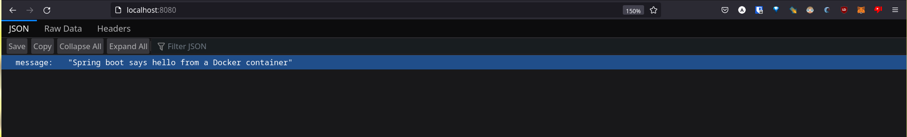
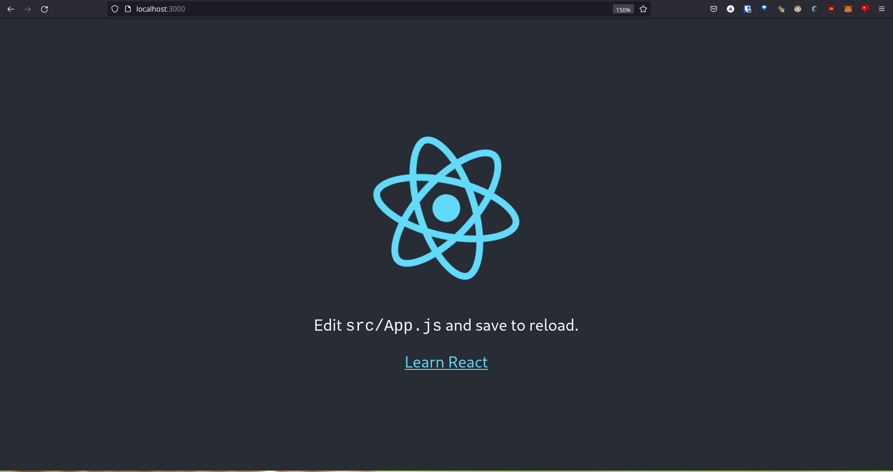

# TP 6

## 1

- FROM: Es la imagen base que se utilizará para crear la nueva imagen. La mínima posible es 'scratch', pero generalmente se utilizan imágenes con las herramientas necesarias para ejecutar las instrucciones básicas requeridas por el proyecto.
- RUN: Ejecuta cualquier comando de shell en la capa actual de la imagen.
- CMD: Provee la ejecución default del contenedor. 
- ADD: Copia archivos desde la computadora local o una url a una imagen.
- COPY: Es un ADD con menos funcionalidad. Se recomienda su uso cuando no se requieren las funcionalidades extra que otorga ADD
- EXPOSE: Sirve para señalar qué puertos utilizará el contenedor para conectarse con el exterior.
- ENTRYPOINT: Es la primer acción ejecutada por el contenedor al momento de iniciarse. El entrypoint por defect es "/bin/sh -c". Cualquier acción CMD agregada al Dockerfile se ejecutará luego del entrypoint: "/bin/sh -c <CMD>"

## 2
Compilo el proyecto:

```
[INFO] ------------------------------------------------------------------------
[INFO] BUILD SUCCESS
[INFO] ------------------------------------------------------------------------
[INFO] Total time:  3.555 s
[INFO] Finished at: 2022-09-29T15:42:25-03:00
[INFO] ------------------------------------------------------------------------

```

java:8 está deprecado, por lo que cambié la primer línea del Dockerfile a:

```
FROM openjdk:8-jre-alpine
```

Contenedor en ejecución:



Desde una terminal:

```
❯ curl -v localhost:8080 
*   Trying 127.0.0.1:8080... 
* Connected to localhost (127.0.0.1) port 8080 (#0) 
> GET / HTTP/1.1 
> Host: localhost:8080 
> User-Agent: curl/7.84.0 
> Accept: */* 
> 
* Mark bundle as not supporting multiuse 
< HTTP/1.1 200 
< Content-Type: application/json;charset=UTF-8 
< Transfer-Encoding: chunked 
< Date: Thu, 29 Sep 2022 19:06:39 GMT 
< 
* Connection #0 to host localhost left intact 
{"message":"Spring boot says hello from a Docker container"}
```

## 3

La nueva versión del Dockerfile reduce drásticamente el tamaño el tamaño de la imagen generada.
Aprovecha el hecho de que java es un lenguaje compilado y lo único que necesita para ejecutar una aplicación son los archivos .jar. 
El proceso es el siguiente:

- Crea un contenedor que descarga todas las dependencias y herramientas necesarias para compilar la aplicación
- Crea un segundo contenedor con un entorno más pequeño que sólo tiene lo necesario para correr aplicaciones de java. 
- Copia los archivos .jar del primer contenedor al segundo más pequeño
- Define un entrypoint y un healthcheck para el contenedor creado

El primer contenedor es descartado durante el proceso, la única imagen creada es la que utiliza el entorno más pequeño.

El comando HEALTHCHECK sirve para decirle a Docker cómo chequear que el contenedor sigue funcionando correctamente.

## 4

Se levantaron dos contenedores. El primero, 'app', utiliza un Dockerfile para construirse, build.context señala la ubicación del mismo. El segundo, 'redis', descarga una imagen de la web.

## 5

[Dockerfile](./nodejs-docker/my-app/Dockerfile)

Comandos utilizados:

```
❯ docker build -t test-react-app .
❯ docker run -p 3000:3000 test-react-app
```

Aplicación corriendo:



## 6

```
❯ docker push coffeedude98/test-react-app:latest 
The push refers to repository [docker.io/coffeedude98/test-react-app] 
9c004f0410b5: Pushed 
fe8011e2dc43: Pushed 
bf4e176a4d9b: Mounted from library/nginx 
a1d571e4e83d: Mounted from library/nginx 
6d97b4d00719: Mounted from library/nginx 
2a7647ca3937: Mounted from library/nginx 
549c42eea4a6: Mounted from library/nginx 
994393dc58e7: Mounted from library/nginx 
latest: digest: sha256:0371100d03bc6fdc2b10010cb5a0fb13f5a0fd88517254eb6a67af2645da0d29 size: 1985 
```
