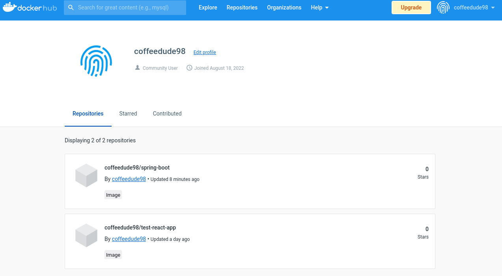

# Trabajo 7

## 1

## 2

TODO

## 3

Instalando el plugin:

Configuración de herramientas:

Configurando instalación automática de Maven:

## 4

Usando el pipeline de ejemplo "Hello World":

Jenkins señala el usuario que comenzó el pipeline y lo ejecuta en un workspace por defecto.
Imprime "Hello World" y termina exitosamente.

## 5

Usando el pipeline de ejemplo "Github + Maven":

El script comienza defieniendo que puede ser ejecutado en cualquier nodo disponble: `agent-any`.

Continua definiendo las herramientas que va a usar, que en este caso es la versión de Maven que configuramos con anterioridad.
Define las etapas, en este caso sólo una, y los pasos a seguir en dicha etapa.

La etapa definida busca el código fuente del proyecto en git y corre `mvn` para compilar el paquete y ejecutar los tests unitarios, creando el build incluso si los tests fallan.

Finalmente luego de pasar por el proceso de construcción guarda los resultados de los tests y archiva el .jar compilado.

El script corre pero el build es inestable:

Analizando el test fallido se puede encontrar un mensaje de error descriptivo:

## 6

El script utilizado para construir Spring Boot es exactamente igual al anterior.
La única diferencia es que busca el código fuente en un repositorio diferente.

[Pipeline Script](spring-boot/Jenkinsfile)

Build Artifacts:

## 7

Configuré las credenciales para acceder a Docker Hub:

Utilizé el plugin de docker pipeline para acceder a mi repositorio de git, crear una imagen utilizando la Dockerfile y subir la imagen a Docker Hub con mis credenciales. El script utilizado fue:

