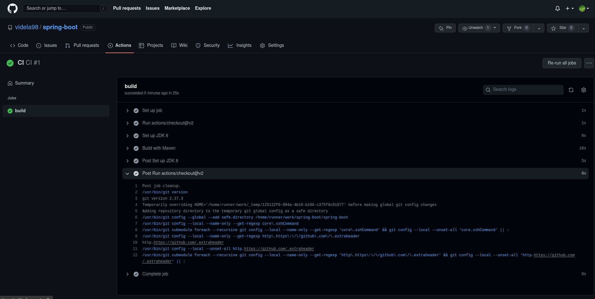
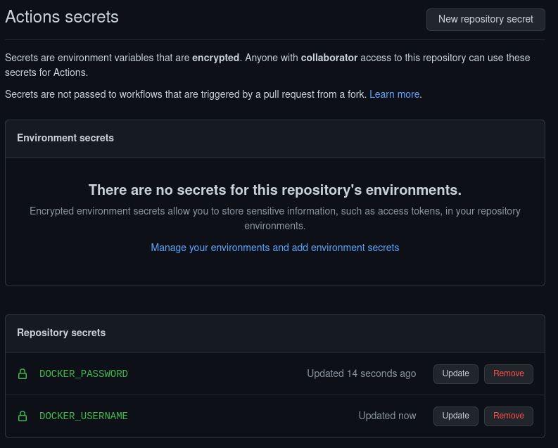
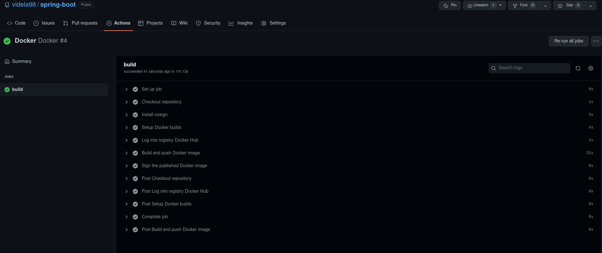

# Trabajo Práctico 8

## 1

TODO

## 2

Luego de crear el archivo, el workflow se ejecuta correctamente:



El workflow está configurado para ejecutarse en cada push o pull request. 
Además se setea para poder ejecutarse manualmente.

El trabajo en sí se encarga de construir el proyecto en una imagen de ubuntu utilizando maven, y luego informar si el proceso se ejecuta con éxito.

## 3

Configuro los secrets "DOCKER_USERNAME" y "DOCKER_PASSWORD"



El archivo final queda:

```yml
name: Docker

# This workflow uses actions that are not certified by GitHub.
# They are provided by a third-party and are governed by
# separate terms of service, privacy policy, and support
# documentation.

on:
  push:
    branches: [ $default-branch ]
    # Publish semver tags as releases.
    tags: [ 'v*.*.*' ]
  pull_request:
    branches: [ $default-branch ]
  
  workflow_dispatch:
  

env:
  # github.repository as <account>/<repo>
  IMAGE_NAME: "coffedude98/spring-boot"

jobs:
  build:

    runs-on: ubuntu-latest
    permissions:
      contents: read
      packages: write
      # This is used to complete the identity challenge
      # with sigstore/fulcio when running outside of PRs.
      id-token: write

    steps:
      - name: Checkout repository
        uses: actions/checkout@v3

      # Install the cosign tool except on PR
      # https://github.com/sigstore/cosign-installer
      - name: Install cosign
        if: github.event_name != 'pull_request'
        uses: sigstore/cosign-installer@f3c664df7af409cb4873aa5068053ba9d61a57b6 #v2.6.0
        with:
          cosign-release: 'v1.11.0'


      # Workaround: https://github.com/docker/build-push-action/issues/461
      - name: Setup Docker buildx
        uses: docker/setup-buildx-action@79abd3f86f79a9d68a23c75a09a9a85889262adf

      # Login against a Docker registry except on PR
      # https://github.com/docker/login-action
      - name: Log into registry Docker Hub
        if: github.event_name != 'pull_request'
        uses: docker/login-action@28218f9b04b4f3f62068d7b6ce6ca5b26e35336c
        with:
          username: ${{ secrets.DOCKER_USERNAME }}
          password: ${{ secrets.DOCKER_PASSWORD }}
          
      # Build and push Docker image with Buildx (don't push on PR)
      # https://github.com/docker/build-push-action
      - name: Build and push Docker image
        id: build-and-push
        uses: docker/build-push-action@ac9327eae2b366085ac7f6a2d02df8aa8ead720a
        with:
          context: .
          push: ${{ github.event_name != 'pull_request' }}
          tags: coffeedude98/spring-boot:latest
         

      # Sign the resulting Docker image digest except on PRs.
      # This will only write to the public Rekor transparency log when the Docker
      # repository is public to avoid leaking data.  If you would like to publish
      # transparency data even for private images, pass --force to cosign below.
      # https://github.com/sigstore/cosign
      - name: Sign the published Docker image
        if: ${{ github.event_name != 'pull_request' }}
        env:
          COSIGN_EXPERIMENTAL: "true"
        # This step uses the identity token to provision an ephemeral certificate
        # against the sigstore community Fulcio instance.
        run: echo "${{ steps.meta.outputs.tags }}" | xargs -I {} cosign sign {}@${{ steps.build-and-push.outputs.digest }}
```

Y es ejecutado con éxito:


